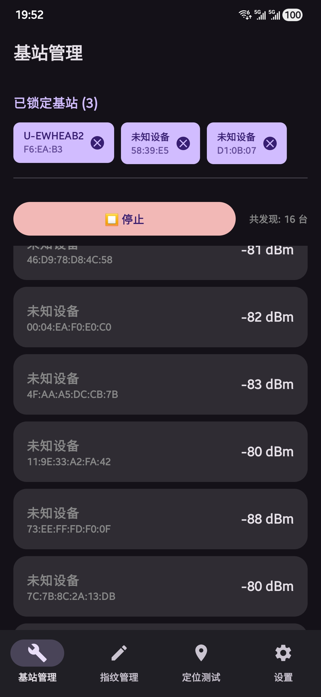
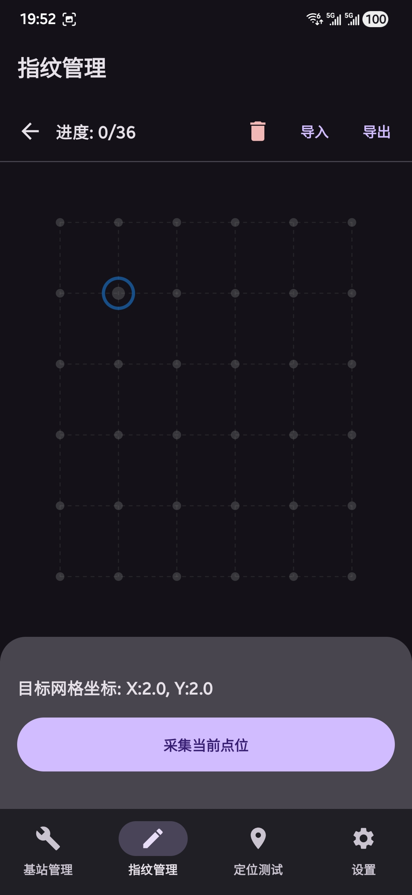
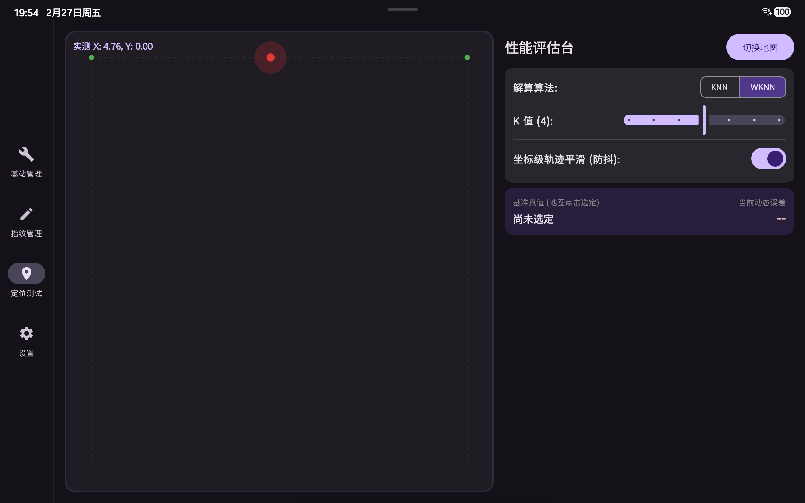

# 📍 IndoorNavi: 基于 BLE 和指纹算法的室内定位系统


IndoorNavi 是一款基于 Android 平台的低功耗蓝牙 (BLE) 室内定位应用，为缺少 GPS 信号的室内环境设计。

## ✨ 核心特性

*  **信号采集**：实时扫描蓝牙信标，结合平滑滤波算法和PDR传感器（v2.0.0更新）剔除 RSSI 异常跳变。
*  **算法引擎**：内置加权 K-近邻 算法，相比传统 KNN 显著提升定位精度。
*  **点阵雷达**：采用 Android底层 `Canvas` 绘制雷达地图。
*  **自适应布局**：基于 `BoxWithConstraints` 实现响应式设计，适配手机竖屏与平板横屏。
*  **深色模式**：全局 Material Design 3 规范，可跟随系统深色/浅色模式切换。
*  **开发者模式**：
    *  Proto Version:
    * 动态调节 $K$ 值与算法类型 (KNN vs WKNN)。
    * 开启/关闭基于指数移动平均的坐标级轨迹防抖。
    * 点击雷达图设定基准真值，**实时动态测算定位误差 (米)**。
    *  v2.0.0:
    * 基于PDR传感器的硬件去抖。
    * 360°测量，取平均的指纹采集方法。
    * 毛玻璃dock栏，带有果冻动效。
    * 自选主题色，自适应壁纸主题色。 

## 📐 算法原理

本系统采用位置指纹法。在在线定位阶段，系统收集实时接收信号强度指示 (RSSI)，并计算其与离线指纹库中各参考点特征向量的欧式距离：

$$D_i = \sqrt{\sum_{j=1}^{n} (S_j - F_{ij})^2}$$

获取最近的 $K$ 个参考点后，系统采用距离的倒数作为权重进行加权平均解算，从而得出最终的物理坐标，有效缓解了信号衰减非线性带来的定位误差。

## 📸 系统截图


| 基站锁定与管理 | 沉浸式指纹采集 | 平板模式 & 开发者评估台 |
| :---: | :---: | :---: |
|  |  |  |

## 🚀 快速开始

### 1. 环境要求
* Android Studio
* Android 8.0 (API 26) 及以上物理真机（**必须具备蓝牙硬件，不支持模拟器测试**）
* 至少 3 个 BLE 蓝牙信标

### 2. 使用工作流
1.  **基站配置**：进入【基站管理】，扫描并锁定场景内部署的至少 3 个目标 Beacon。
2.  **离线建库**：进入【指纹管理】，设置物理空间的宽、长与采样间距，生成点阵地图。手持设备在对应网格点点击“采集”，完成后可导出为 CSV 文件。
3.  **在线定位**：进入【定位测试】，引擎将自动加载指纹数据并在雷达图上生成跳动的红点（当前预测坐标）。
4.  **性能测算**：在【设置】中开启“开发者性能评估模式”，返回定位页即可通过点击地图生成蓝色真值点，并实时拉线测算误差。

## 📁 目录结构
```text
com.example.indoornavi/
│
├── MainActivity.kt        # 宿主 Activity 与响应式主路由
├── BleScanner.kt          # BLE 蓝牙高频扫描与 RSSI 平滑处理模块
├── WknnLocator.kt         # 核心数学大脑：KNN/WKNN 定位解算引擎
├── SharedViewModel.kt     # 全局状态管家，解决后台数据保活问题
└── ...
```
## 👨‍💻 关于此软件
* Core Developer: Casper-003
* Contact: casper-003@outlook.com
* Institution: LNU
* 本项目为本科毕业设计成果。

## 📄 开源协议
This project is licensed under the MIT License.
